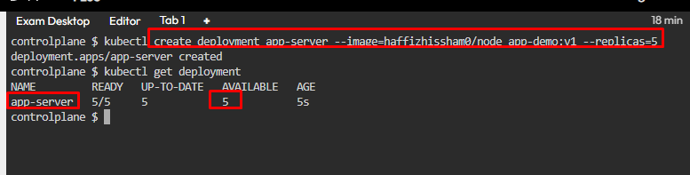
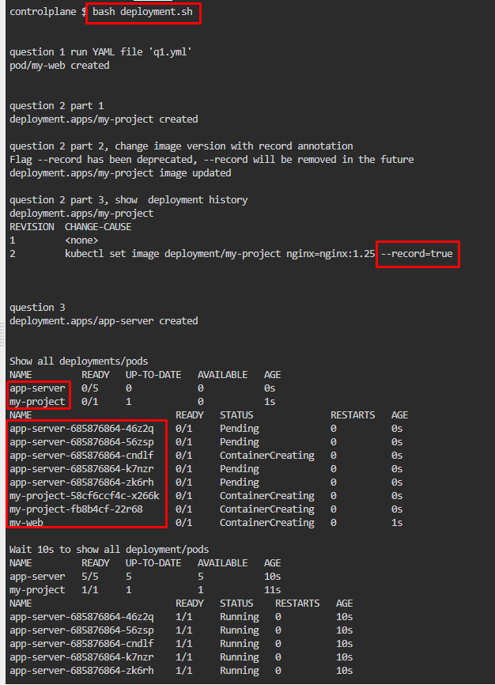

# Kubernetes Test Questions 1
##### Questions
```
1.Create a new pod called my-web image nginx
Allow the pod to be able to set system_time
The container should sleep for 2200 seconds

2.Create a new deployment called my-project, with image
nginx and 1 replica .Next upgrade the deployment to version nginx:1.25 using
rolling update.Make sure that version upgrade is recorded in the resource annotation.

3.Set up a Kubernetes deployment named app-server using the my-app-server:v1 image and initially scale it to 5 replicas. Ensure that the deployment is configured to maintain the desired number of pods, even if some pods fail.
```


## Question 1:
1.	Run this command, ```kubectl run my-web --image=nginx --command sleep 2200 --dry-run=client -o yaml > nginx.yml```
   * 

2. Edit the output file, add security context (**SYS_TIME**) to the code
   * 

3. Run the YAML file, ```kubectl apply -f nginx.yml```
   * 


## Question 2:
1.	Run this command, ```kubectl create deployment my-project --image=nginx```
   * 

2.	Change image of the deployment; ```kubectl set image deployment/my-project nginx=nginx:1.25 --record```
   * 

3.	Check rollout history, ```kubectl rollout history deployment my-project```
   * 


## Question 3:
1.	Run this command, ```kubectl create deployment app-server --image= haffizhissham0/node_app-demo:v1 –replicas=5```
   * 


## Bonus - Batch deployment for all three questions:
1. Create a YAML file for the first question, save it as ```q1.yml```
   * `nano q1.yml`
   * ```yaml
      apiVersion: v1
      kind: Pod
      metadata:
      creationTimestamp: null
      labels:
         run: my-web
      name: my-web
      spec:
      containers:
      - command:
         - sleep
         - "2200"
         image: nginx
         securityContext:
            capabilities:
               add: ["SYS_TIME"]
         name: my-web
         resources: {}
      dnsPolicy: ClusterFirst
      restartPolicy: Always
      status: {}
      ``` 

2. Create a **Deployment** bash file, save the file as `deployment.sh`
   * Run bash script, `bash deployment.sh` to create deployments/pods
   * ```bash
      #!/bin/bash

      # Question 1
      printf "\n\n"
      echo "question 1 run YAML file 'q1.yml'"
      kubectl apply -f q1.yml

      # Question 2
      printf "\n\n"
      echo "question 2 part 1"
      kubectl create deployment my-project --image=nginx

      printf "\n"
      echo "question 2 part 2, change image version with record annotation"
      kubectl set image deployment/my-project nginx=nginx:1.25 --record

      printf "\n"
      echo "question 2 part 3, show  deployment history"
      kubectl rollout history deployment my-project

      #Question 3
      printf "\n\n"
      echo "question 3"
      kubectl create deployment app-server --image=haffizhissham0/node_app-demo:v1 --replicas=5

      # Show all deployments/pods
      printf "\n\n"
      echo "Show all deployments/pods"
      kubectl get deployment
      kubectl get pod

      sleep 10s
      
      printf "\n"
      echo "Wait 10s to show all deployment/pods"
      kubectl get deployment
      kubectl get pod
      ```

3. 

4. Create a **Deployment Delete** bash file, save the file as `delete-deployment.sh`
   * Run bash script, `bash delete-deployment.sh` to delete previous deployments/pods create
   * ```bash
      #!/bin/bash

      # Show all deployments/pods before destroying those
      printf "\n\n"
      echo "Show all deployments/pods"
      kubectl get deployment
      kubectl get pod

      # Destroy my-web pod created on question (1)
      printf "\n\n"
      echo "Destroy my-web pod"
      kubectl delete pod my-web

      # Destroy my-project deployment created on question (2)
      printf "\n\n"
      echo "Destroy my-project deployment"
      kubectl delete deployment my-project

      # Destroy app-server deployment created on question (3)
      printf "\n\n"
      echo "Destroy app-server deployment"
      kubectl delete deployment app-server

      # Show all deployments/pods after destroyed
      printf "\n\n"
      echo "Wait 15s to show all deployment/pods after destroyed"

      sleep 15s

      printf "\n"
      kubectl get deployment
      kubectl get pod
      ```
5. 