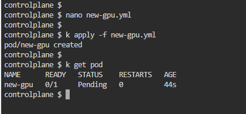
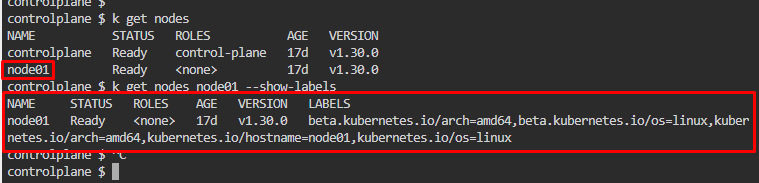
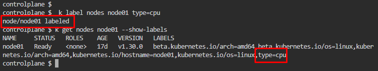
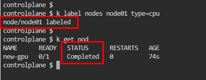

# Kubernetes Test Questions 11; 29 May 2024

##### Questions
```
1.
Create a YAML file to define a pod named new-gpu that uses the busybox image. 

Use nodeSelector to ensure the pod is scheduled only on nodes with the label type=cpu  ̶a̶n̶d̶ ̶r̶e̶s̶t̶o̶r̶e̶ ̶t̶h̶e̶ ̶b̶a̶c̶k̶u̶p̶ ̶a̶t̶ ̶v̶a̶r̶/̶l̶i̶b̶/̶m̶y̶n̶e̶w̶b̶a̶c̶k̶u̶p̶.
```
<br>

## References:
1. [Pods | Kubernetes](https://kubernetes.io/docs/concepts/workloads/pods/#using-pods)

<br>

## Question 1:
1. **Create** a** YAML script**, `nano new-gpu.yml`
   * ```yaml
        apiVersion: v1
        kind: Pod
        metadata:
          name: new-gpu
        spec:
          containers:
          - name: new-gpu
            image: busybox
          nodeSelector:
            type: cpu
      ```

2. Apply the script and check pod status, `k apply -f new-gpu.yml`
   * `k get pod`
   * 

3. Pod **status** is **pending** because of **no nodes** has **label cpu**. Check nodes’ label,  `k get nodes node01 --show-labels`
   * 

4. **Apply label cpu** on node01, `k label nodes node01 type=cpu`
   * 

5. Facing issue on pod not running despite already labelled node01 with cpu
   * 
   * 

6. **Restart KillerCoda** and try again from the first step

7. Pod status changed to completed after label applied
   * 
   * 