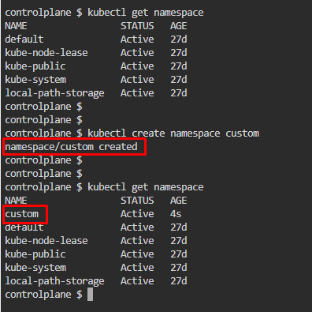
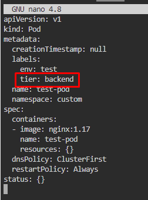
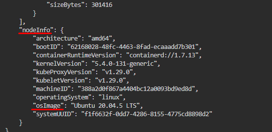
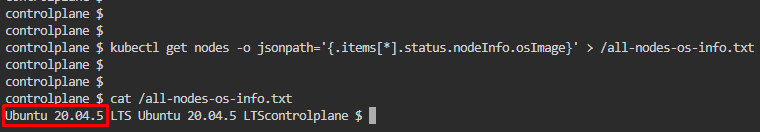

# Kubernetes Test Questions 3; 9 May 2024

##### Questions
```
1.
Create a pod called test-pod in the "custom" namespace belonging to the test environment (env=test) and backend tier (tier=backend). Use the NGINX image with version 1.17.


2.
Retrieve the node named node01 in JSON format and store it in a file named /node-info.json. 

3.
Use JSON PATH query to retrieve the osimages of all the nodes and store it in a file named "all-nodes-os-info.txt" at the root location.
```

## Question 1:
1. Create custom namespace, `kubectl create namespace custom`
   * 
  
2. Create a YAML file as per outlined by question, 
   * `kubectl run test-pod --image=nginx:1.17 -n custom -l env=test --dry-run=client -o yaml > q1.yml`
   * 

3. Edit YAML file created, `nano q1.yml`. Add another label **tier=backend**, Save and exit.
   * 

4. Deploy the YAML script, `kubectl apply -f q1.yml`. 
   * Then check created pod, `kubectl get pods -A` or `kubectl get pods -A`
   *


## Question 2:
1. Run a command to get a node01’s info and store it **as a JSON file**, `kubectl get node node01 -o json > node-info.json`
   * 


## Question 3:
1. Use **JSON PATH query** to find nodes’ OS image

2. Refer to Viewing and finding resources section on [Kurbenetes’ Quick Reference document](https://kubernetes.io/docs/reference/kubectl/quick-reference/#viewing-and-finding-resources).
   * Modify the command as applicable. Refer to this [JSON PATH guide](https://kubernetes.io/docs/reference/kubectl/jsonpath/) for more information  
   * 

3. Change `kubectl get nodes -o jsonpath='{.items[*].status.addresses[?(@.type=="ExternalIP")].address}'` to:
   * `kubectl get nodes -o jsonpath='{.items[*].status.nodeInfo.osImage}' > /all-nodes-os-info.txt`
   * Follow the proper notation,
     * 

4.	Display the txt file created to get OS Image, `cat /all-nodes-os-info.txt`
     * 