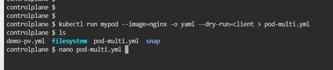
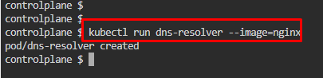
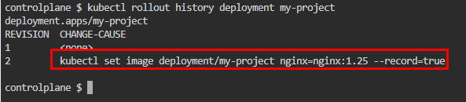

# Kubernetes Test Questions 4; 10 May 2024

##### Questions
```
1.Create a YAML file defining a Persistent Volume (PV) named user-data-pv with the following characteristics:

-Uses the hostPath storage type with the path /mnt/ssd
-Provides ReadWriteOnce access mode
-Reclaims the storage automatically when the PV becomes unbound from a Persistent Volume Claim (PVC)

___

2.create pod of mypod with the image of nginx+redis

___

3.Create an NGINX Pod named "dns-resolver" using the NGINX image. 

Expose it internally within the cluster with a Service named "dns-resolver-service". 

Verify whether both the Pod and the Service names are resolvable from within the cluster. Utilize the BusyBox image version 1.28 for DNS lookup. 

Save the result of the DNS lookup in the file "/root/nginx.svc".

___

4.Create a new Deployment named "my-project" with the NGINX image, configured to have one replica. 

Then, upgrade the deployment to version "nginx:1.25" using rolling update strategy. 

Ensure that the version upgrade is recorded in the resource annotation
```

## Question 1:
1. Volume can’t be created from command line, need to write a YAML script. `nano demo-pv.yml` . Paste the code below.
   * Set **Persistent Volume Claim (PVC)** to **retain**; [Kubernetes Reference](https://kubernetes.io/docs/concepts/storage/persistent-volumes/#persistent-volume-using-a-raw-block-volume)
   * ```yaml
        apiVersion: v1
        kind: PersistentVolume
        metadata:
            name: user-data-pv
        spec:
            capacity:
                storage: 100Mi
            volumeMode: Filesystem
            accessModes:
                - ReadWriteOnce
            persistentVolumeReclaimPolicy: Retain
            hostPath:
                path: /mnt/ssd
      ```

2.	Apply the YAML script to create the volume, `kubectl apply -f demo-pv.yml`

3. Check persistent volume created, `kubectl get pv`.
   * 


## Question 2:
1. Run a command to get a pod named **mypod** and store it as YAML file to modify it later, `kubectl run mypod --image=nginx -o yaml --dry-run=client > pod-multi.yml`
   * 

2. Add a container for redis image into the YAML code. Copy YAML code below:
   * ```yaml
        apiVersion: v1
        kind: Pod
        metadata:
            creationTimestamp: null
            labels:
                run: mypod
            name: mypod
        spec:
            containers:
            - image: nginx
                name: nginx
            - name: redis
                image: redis
                resources: {}
            dnsPolicy: ClusterFirst
            restartPolicy: Always
        status: {}
      ```
3. Apply the YAML, `kubectl apply -f pod-multi.yml`
   * 

4. Describe **mypod** to see the containers
   * 


## Question 3:
1. Create a pod named **dns-resolver** using the **NGINX image**, `kubectl apply -f pod-multi.yml`
  * 

2. Expose the pod internally within the cluster under service named **dns-resolver-service**
  * `kubectl expose pod dns-resolver --name=dns-resolver-service --port=80 --target-port=80 --type=ClusterIP` 
  * View service created, `kubectl get svc`
    * 

3. Verify the pods and service name are resolveable from within the cluster
  * Utilize the **BusyBox image** version **1.28** for DNS lookup  
  * Save the result of the DNS lookup in the file **/root/nginx.svc**
  * Run, `kubectl run test-nslookup --image=busybox:1.28  --rm -it --restart=Never -- nslookup dns-resolver-service > /root/nginx.svc `
  * View the DNS lookup result, `cat /root/nginx.svc`
    * 


## Question 4:
1. Create a new Deployment named "**my-project**" with the **NGINX image**, `kubectl create deployment my-project --image=nginx`

2. Set the deployment to **use** nginx image **version 1.25**.
  * Use rolling update strategy. 
  * Ensure that the version upgrade is **recorded** in the resource annotation
  * `kubectl set image deployment/my-project nginx=nginx:1.25 –record`
    * 

3. Describe the pod again to check the deployment image, `kubectl describe pods my-project-***`
  * 
  * 

4. Check rollout history, `kubectl rollout history deployment my-project`
  * 