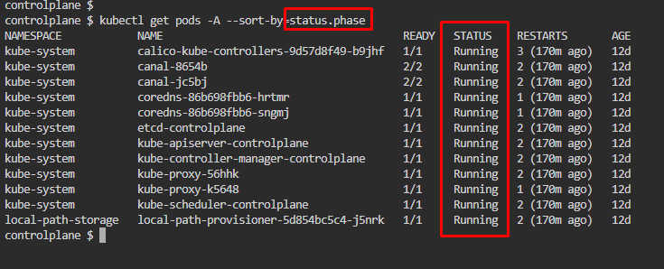
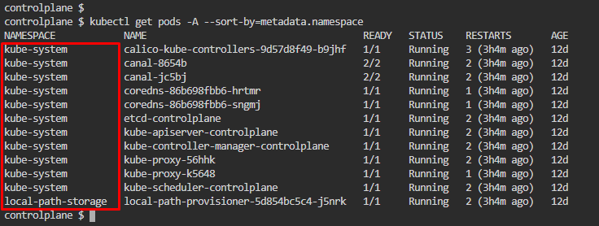

# Kubernetes Test Questions 5; 16 May 2024
##### Questions
```
1. Create a replicaset named "appychip" using the NGINX image with a replica count of 4. Ensure that the total count of pods running in the cluster does not exceed 4, considering that there is already a pod running in the cluster.


2. Create a network policy named "appychip" in the default namespace. This network policy should include both ingress and egress rules.
For ingress traffic, block all traffic from an IP range of your choice, except for specified IP ranges. Include namespace and pod selectors in the policy. Ensure that the ports allowed for ingress traffic are limited to 6379.
For egress traffic, allow traffic to an IP range of your choice on port 5978.

3. Imagine you're managing a Kubernetes cluster with various namespaces and pods. You need to create a script to help you find pods efficiently. Write a command to list all pods sorted by their status. Additionally, write another command to list pods sorted by their namespace. Provide the commands you would use for each sorting criterion.
```

<br>

## References:
1. [ReplicaSet | Kubernetes](https://kubernetes.io/docs/concepts/workloads/controllers/replicaset/)
2. [Network Policies | Kubernetes](https://kubernetes.io/docs/concepts/services-networking/network-policies/)
3. [Complete list of pod statuses | StackOverflow](https://stackoverflow.com/questions/69035324/complete-list-of-pod-statuses#comment122014046_69035324)

<br>

## Question 1:
1. Create a YAML script for replicaset, set the **replica value to 1**
   * `nano appychip.yaml`
   * ```yaml
      apiVersion: apps/v1
      kind: ReplicaSet
      metadata:
         name: appychip
         labels:
            app-type: replicaset
      spec:
         # modify replicas amount according to your case
         replicas: 1
         selector:
            matchLabels:
               app-type: replicaset
         template:
            metadata:
               labels:
                  app-type: replicaset
            spec:
               containers:
               - name: nginx    
               image: nginx
      ```

2. Apply the YAML script to deploy the pod, and pod quantity
   * `kubectl apply -f appychip.yaml` & `kubectl get pods`
   * 

3. Edit the YAML file to **change** the **replicas value to 4**
   * Reapply the YAML script and check pod quantity again
   * 


## Question 2:
1. Create a Network Policy YAML script, **network.yaml** . Refer to Kubernetes documentation
   * ```yaml
      apiVersion: networking.k8s.io/v1
      kind: NetworkPolicy
      metadata:
         name: appychip
         namespace: default
      spec:
         podSelector:
            matchLabels:
               role: db
         policyTypes:
         - Ingress
         - Egress
         ingress:
         - from:
            - ipBlock:
               cidr: 172.17.0.0/16
               except:
               - 172.17.1.0/24
            - namespaceSelector:
               matchLabels:
                  project: myproject
            - podSelector:
               matchLabels:
                  role: frontend
            ports:
            - protocol: TCP
               port: 6379
         egress:
         - to:
            - ipBlock:
               cidr: 10.0.0.0/24
            ports:
            - protocol: TCP
               port: 5978
      ```

2. Apply the YAML script to deploy the network policy
   * `kubectl apply -f appychip.yaml`
   * 

3. Check network policy created, `kubectl get networkpolicy appychip` & `kubectl describe networkpolicy appychip`
   * 

## Question 3:
1. Sort all pods by their status
   * `kubectl get pods -A --sort-by=status.phase`
   * `-A` = switch to get all  of the pods
   * `--sort` = sort element
   * 

2. Additional:
   1. Get count of pods for each state, `kubectl get pod -A --no-headers |awk '{arr[$4]++}END{for (a in arr) print a, arr[a]}'`
      * 
      * 

3. Sort all pods by their namespace, `kubectl get pods -A --sort-by=metadata.namespace`
   * `-A` = switch to get all  of the pods
   * tips: try to put output in JSON format to get the fieldPath value, `kubectl get pods -A -o json | grep namespace`
     * 
   * Use the value (`metadata.namespace`) from tips above to sort the pods
     * 