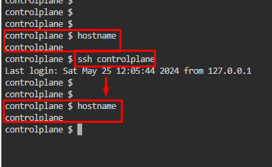
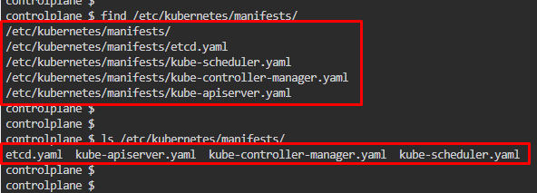
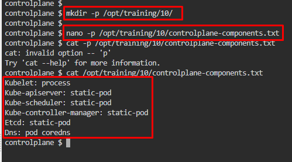
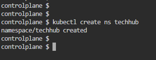
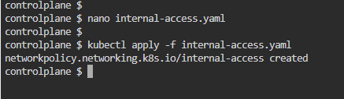
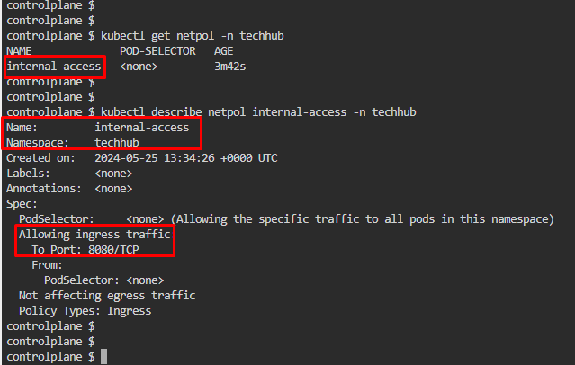

# Kubernetes Test Questions 6; 17 May 2024
##### Questions
```
1.
SSH into the control plane node with ssh cluster2-controlplane1. Check how the control plane components kubelet, kube-apiserver, kube-scheduler, kube-controller-manager, and etcd are started/installed on the control plane node. 

Also, find out the name of the monitoring application and how it is started/installed on the control plane node. Write your findings into the file /opt/training/10/controlplane-components.txt. The file should be structured like:

#/opt/training/10/controlplane-components.txt
Kubelet: [Type]
Kube-apiserver: [Type]
Kube-scheduler: [Type]
Kube-controller-manager: [Type]
Etcd: [Type]
Monitoring: [Type] [Name]

___

2.
Create a namespace named techhub.
Create a new network policy named internal-access in the techhub namespace.

Requirements:
•	Network policy should allow pods within the techhub namespace to connect to each other only on port 8080. No other ports should be allowed.
•	No pods from outside of the techhub namespace should be able to connect to any pods inside the techhub namespace.
```

<br>

## References:
1. [Constants and well-known values and paths | Kubernetes Implementation details](https://kubernetes.io/docs/reference/setup-tools/kubeadm/implementation-details/#constants-and-well-known-values-and-paths)
2. [Kubernetes Namespace](https://www.aquasec.com/cloud-native-academy/kubernetes-101/kubernetes-namespace/)
3. [Network Policies | Kubernetes](https://kubernetes.io/docs/concepts/services-networking/network-policies/#default-deny-all-ingress-traffic)

<br>

## Question 1:
1. Killercoda by default already connected to controlplane node, so doesn’t need to open another SSD connection. 
   * But if applicable, connect to controlplane node, `ssh controlplane`
   * 

2. Get list of components available in controlplane, use find `/etc/kubernetes/manifests/`
   * Or `ls /etc/kubernetes/manifests/`
   * 

3. Check kube-system pods running on controlplane, `kubectl -n kube-system get pod -o wide | grep controlplane`
   * kube-system — a default space for Kubernetes system objects
     * eg, **kube-dns** and **kube-proxy**, and **add-ons** providing **cluster-level features**, such as **web UI dashboards**, **ingresses**, and **cluster-level logging**
   * 

4. Check kube-system deployed, `kubectl -n kube-system get deploy`
   * 

5. Create a directory as question specified, `mkdir -p /opt/training/10/`
   * Create a text file named **controlplane-components.txt**, `nano -p /opt/training/10/controlplane-components.txt`
   * Paste answer following the schema
   * ```yaml
      Kubelet: process 
      Kube-apiserver: static-pod
      Kube-scheduler: static-pod
      Kube-controller-manager: static-pod
      Etcd: static-pod
      Dns: pod coredns
     ```
   * 


<br>

## Question 2:
1. Create a **namespace** for **techhub**, `kubectl create ns techhub`
   * `ns` = namespace, short notation
   * 

2. Check pod running with the namespace created
   * `kubectl get pods -n techhub`	
   * `kubectl get pods -A`
   * 

3. Create a **new network policy** named **internal-access** in the **techhub namespace**, `nano internal-access.yaml`
   * Apply the network policy script created, `kubectl apply -f internal-access.yaml`
   * ```yaml
        apiVersion: networking.k8s.io/v1
        kind: NetworkPolicy
        metadata:
            name: internal-access
            namespace: techhub
        spec:
            podSelector: {}
            policyTypes:
            - Ingress
            ingress:
            - from:
                - podSelector: {}
              ports:
              - protocol: TCP
                port: 8080
      ```
   * 

4. Check network policy created
   * `kubectl get netpol -n techhub` or `kubectl describe netpol internal-access -n techhub`
     * `netpol` = network policy, short notation
   * 
