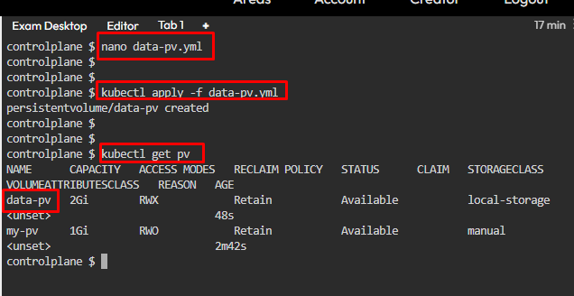

# Kubernetes Test Questions 7; 20 May 2024

##### Questions
```
1. 
Create a Persistent Volume (PV) and a corresponding Persistent Volume Claim (PVC) and then use it in a Pod.

Create a Persistent Volume named data-pv with the following specifications:
> Capacity: 2Gi
> Access Modes: ReadWriteMany
> HostPath: /mnt/storage
> Storage Class: local-storage

Create a Persistent Volume Claim named data-pvc with the following specifications:
> Requested Storage: 2Gi
> Access Modes: ReadWriteMany
> Storage Class: local-storage

Create a Pod named app-pod that uses the PVC data-pvc to mount the volume at /data/app.

Verify that the Pod is running and using the Persistent Volume.

```

## References:
1. [Persistent Volumes | Kubernetes](https://kubernetes.io/docs/concepts/storage/persistent-volumes/%23reserving-a-persistentvolume)
   * [Persistent Volumes | claims-as-volumes](https://kubernetes.io/docs/concepts/storage/persistent-volumes/#claims-as-volumes)
2. [Storage Classes | Kubernetes](https://kubernetes.io/docs/concepts/storage/storage-classes/)


## Steps:
1. Volume can’t be created from command line, need to write a YAML script. `nano demo-pv.yml`
   * Paste the code below and save the YAML file:
   * ```yaml
        apiVersion: v1
        kind: PersistentVolume
        metadata:
            name: data-pv
        spec:
            capacity:
                storage: 2Gi
            accessModes:
                - ReadWriteMany
            hostPath:
                path: /mnt/storage    
            storageClassName: local-storage
      ```

2.	Apply the YAML script to create the volume, `kubectl apply -f data-pv.yml`

3. Check persistent volume created, `kubectl get pv`.
   * 

4. Create a PVC script, `nano data-pvc.yml`
   * Paste the code below and save the YAML file:
   * ```yaml
        apiVersion: v1
        kind: PersistentVolume
        metadata:
            name: data-pvc
        spec:
            accessModes:
                - ReadWriteMany
            resources:
                requests:
                    storage: 2Gi
            storageClassName: local-storage
      ```

6. Apply the YAML script to create the volume claim, `kubectl apply -f data-pvc.yml`

7. Check persistent volume claim created, `kubectl get pvc`
   * 

8. Create a YAML file to create/run a pod with PVC volume attached, `nano app-pod.yml`
   * Paste the code below and save the YAML file:
   * ```yaml
        apiVersion: v1
        kind: Pod
        metadata:
            name: app-pod
        spec:
            containers:
                - name: nginx-pod
                    image: nginx
                    volumeMounts:
                        - mountPath: /data/app
                          name: my-storage
            volumes:
                - name: my-storage
                  persistentVolumeClaim:
                    claimName: data-pvc
      ```

9. Apply the YAML script to create the pod, `kubectl apply -f app-pod.yml`

10. Verify the pod is running and using Persistent Volume, `kubectl describe pod app-pod`
    * 