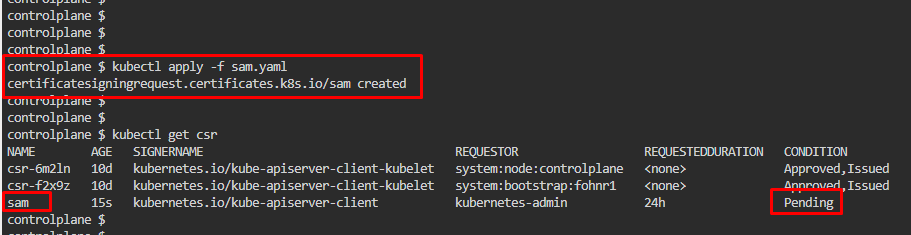
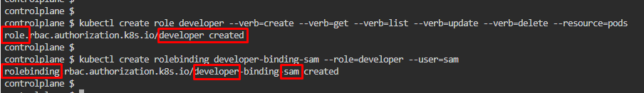
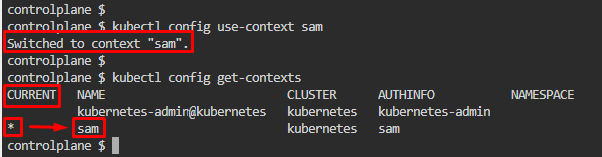

# Kubernetes Test Questions 8; 21 May 2024

##### Questions
```
Create
a new user “sam”.
Grant him access to the cluster.

User “sam”
should have permission to create, list, get, update and delete pods. 

The private key exists at location:
/root/sam.key and csr at /root/sam.csr
```

## References:
1. [Certificates and Certificate Signing Requests | Kubernetes](https://kubernetes.io/docs/reference/access-authn-authz/certificate-signing-requests/#create-private-key)


## Steps:
1. **Create private key** for user and store it under **/root/sam** folder as **sam.key**, `openssl genrsa -out /root/sam.key 2048`

<br>

2. Create a CertificateSigningRequest (CSR) and under **/root/** folder store it as **sam.csr**, `openssl req -new -key /root/sam.key -out /root/sam.csr`
   * View **sam.csr** file to copy request code

<br>

3. Get the content of CSR created
   * Decode the CSR using base64, `cat sam.csr | base64 | tr -d "\n"`
   * Left everything empty for now
   * Copy **CSR request key** created above to paste it on **sam.yaml** file created after this step
   * 

<br>

4. Create YAML file for user creation, `nano sam.yaml`
   * Copy the script on **Create a CertificateSigningRequest**’s section
   * Copy **CSR  key** created on step 3 and paste it on **request attribute**
   * Get the key until before *`controlplane $`*
   * **Edit the name** under metadata as well
   * ```yaml
      apiVersion: certificates.k8s.io/v1
      kind: CertificateSigningRequest
      metadata:
         name: sam
      spec:
         request: LS0tLS1CRUdJTi<....>DQVRFIFJFUVVFU1QtLS0tLQo=
         signerName: kubernetes.io/kube-apiserver-client
         expirationSeconds: 86400  # one day
         usages:
         - client auth
      ```

<br>

5. Apply the YAML, `kubectl apply -f sam.yaml`

<br>

6. Get the list of CSRs created, `kubectl get csr`
   * 

<br>

7. Approve the **CSR created** for user sam, `kubectl certificate approve sam`
   * View list of CSRs again
   * <span style="color:yellow">Additionally, can delete CSRs created as well if needed</span>. `kubectl delete csr sam`
   * 

<br>

8. **Certificate issued** is in **Base64-encoded** format, **export** the issued certificate from the CSR **as decoded** certificate. Save it as **sam.crt**
   * `kubectl get csr sam -o jsonpath='{.status.certificate}'| base64 -d > sam.crt`
   * 

<br>

9. **Create** a developer **role**, `kubectl create role developer --verb=create --verb=get --verb=list --verb=update --verb=delete --resource=pods`
   * `developer` = name of role we want to create. It could be **admin**, **operator**, **support**, etc
     * `--verb` = What action the role could use
     * `-- resource` = What resources the role could access. eg, **deployment**, **replicas**, **nodes**, etc
   * reate a role with necessary permissions/privilege as per the question

<br>

10. **Bind** role created (**developer**) to user (**sam**) created earlier
    * `kubectl create rolebinding developer-binding-sam --role=developer --user=sam`
    * 

<br>

11. Add user created into the **kubeconfig** file, `kubectl config set-credentials sam --client-key=/root/sam.key --client-certificate=/root/sam.crt --embed-certs=true`
    * Use key and certificate created for set sam’s credential under K8s cluster

<br>

12. **Add** user created (**sam**) to user **context**, `kubectl config set-context sam --cluster=kubernetes --user=sam`

<br>

13. View user context, `kubectl config get-contexts`
    * 

<br>
<br>

___

<br>

14. We can **switch user context** to sam if needed, `kubectl config use-context` sam
    * **Asterisk (*)** on the **current column** indicates user context the operator operate as
    * 