# Kubernetes Assignment; 7 May 2024

## Tasks:
```
1.Make a cluster with minikube
2.Setup docker driver
3.Create a deployment of an app of your choice
4.Check deployments and pods
5.Expose the deployment on port
6.Add minikube service and run on browser
7.Make changes on deployment and run changes in app versions
8.Create multiple pods on your app
```

## Steps:
1. Use previous app (node js) created.

2. Create a new Docker Hub repository or use existing, in my case I’m using previous [repository](https://hub.docker.com/repository/docker/haffizhissham0/node_app-demo/general); using port 8081 in the code.
   * 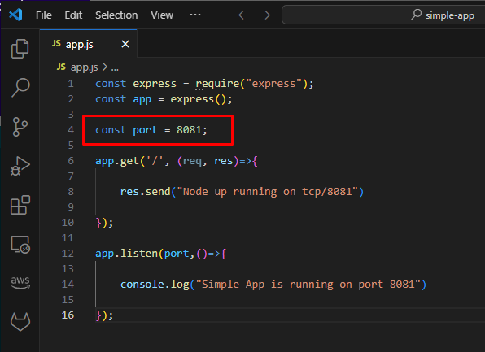

3. Start minikube; ```minikube start --driver=docker```
   * 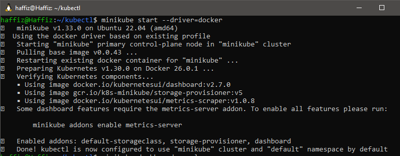

4. Run ```minikube dashboard --url``` to for monitoring purpose.
   * 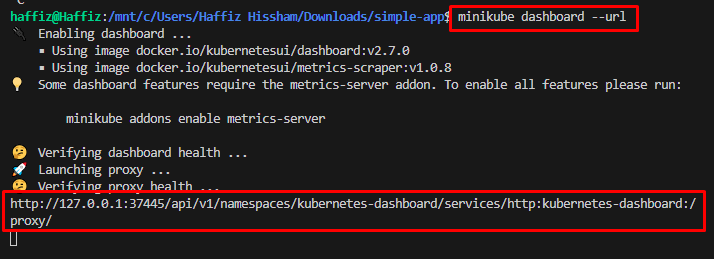
   * 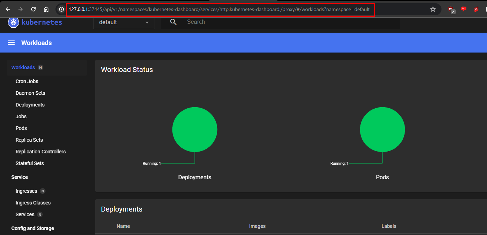

5. Create a deployment on K8s using latest image created from previous assignments; ```kubectl create deployment node-app --image=haffizhissham0/node_app-demo:v2```, and expose the port 8081 as per code written; ```kubectl expose deployment node-app --type=LoadBalancer --port=8081``` 
   * 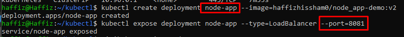

6. Create a tunnel from cluster network to localhost network; ```minikube service node-app --url```
   * 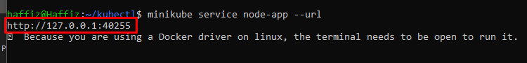

7. Access the app on localhost’s browser.
   * 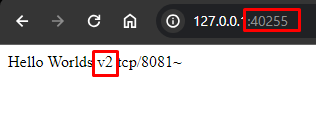

8. Check K8s’ dashboard for the running cluster.
   * Take note of the pods’ name, **node-app-d49c75d7d-s5qhd**
   * 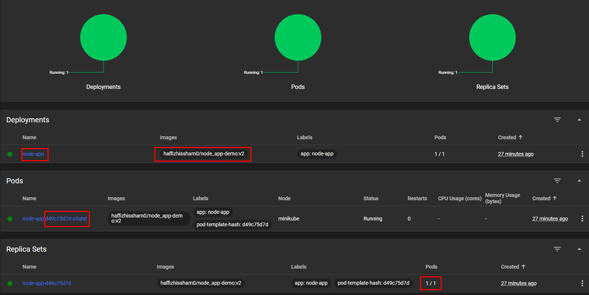

9.  Modify application code (refer to Sam’s [code](https://classroom.google.com/c/NjQ4MTgzNzY5Nzgw/m/Njc3NzQwNzAzMzg4/details) shared on classroom; **process.exit(0)** added in the code )
       * 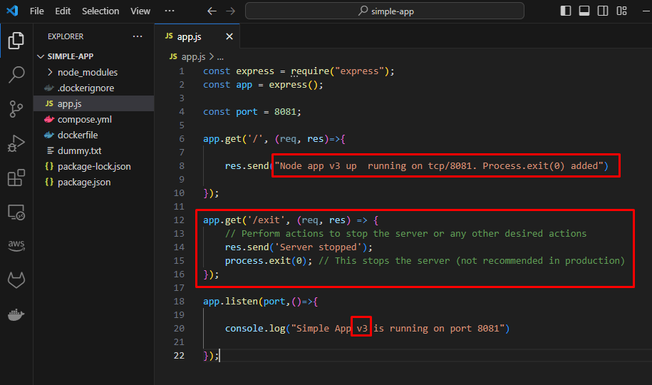
  
10. Build a new image from the modified code, push it to docker hub.
       * 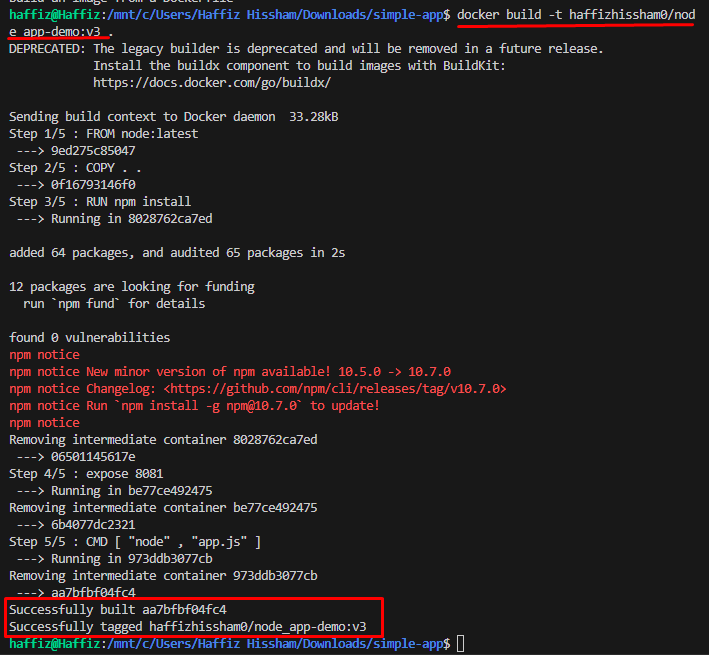
       * 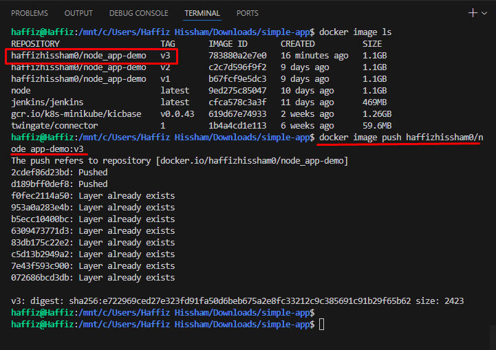
       * 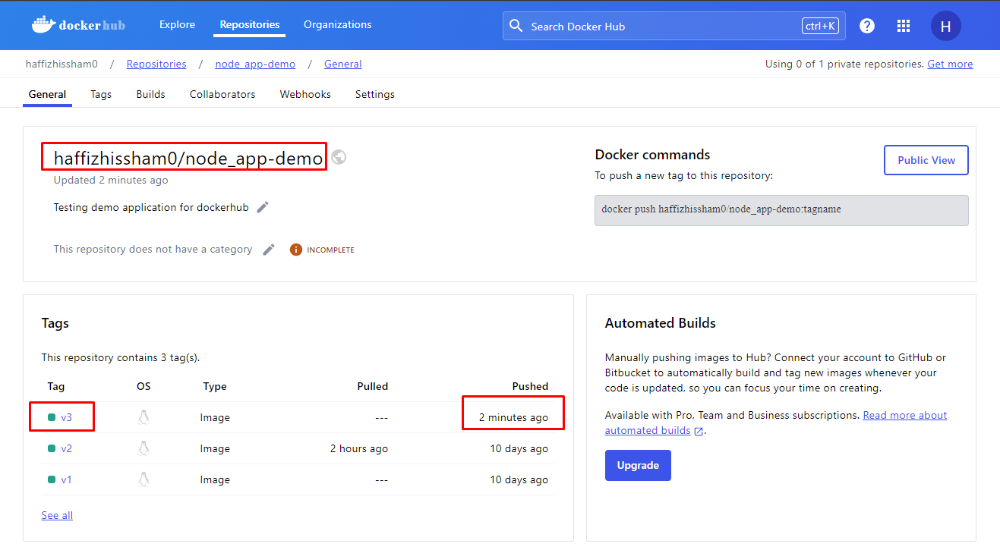

11. Set the deployment to use a new image created.
       * ```kubectl set image deployment node-app node-app-demo-9qsdv=haffizhissham0/node_app-demo:v3```
       * 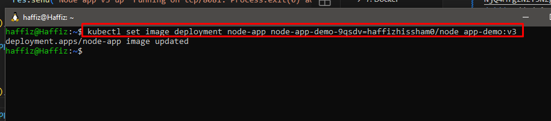

12. Monitor the deployment on dashboard, the services should be temporarily unavailable.
    * 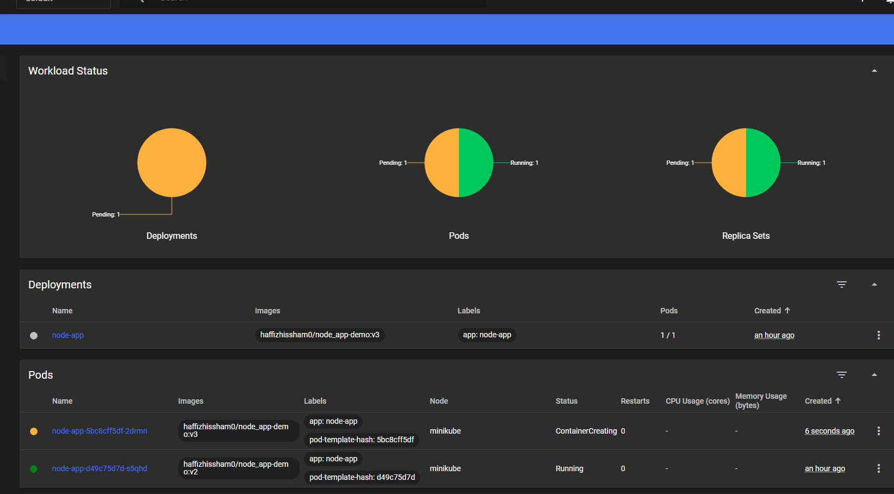

13. K8s will automatically create a new pod with new image and terminating old pods with old image. Take a look at ~~**pods' name**~~ **container name (in the pods)**.
    * 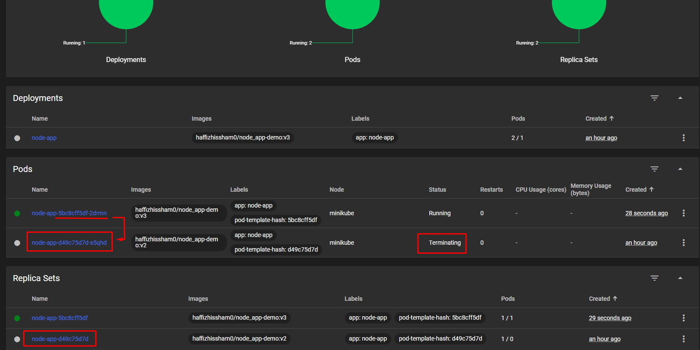

14.   A new up automatically up and running (refresh browser's tab).
         * 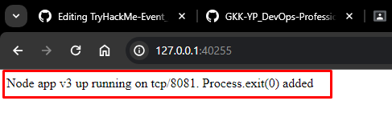

15. Scale the deployment with another 2 pods, ```kubectl scale deployment node-app --replica=3```
    * 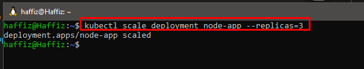
    * 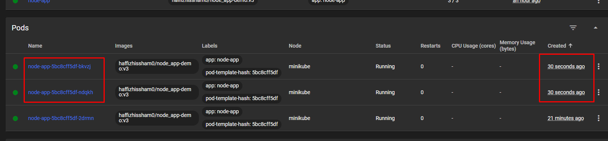

16. Invoke the **process.exit(0)** function to check deploymen's behaviour.
    * 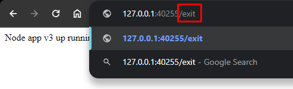
    * 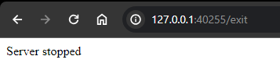

17. Check deployment dashboard, only 1 pod died but other 2 scaled pods is healthy, and the exited pod should be up and running again automatically.
    * 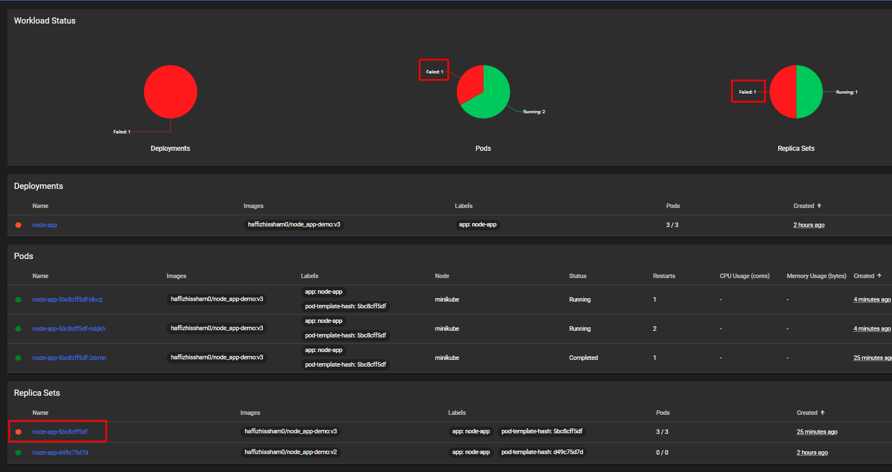
    * 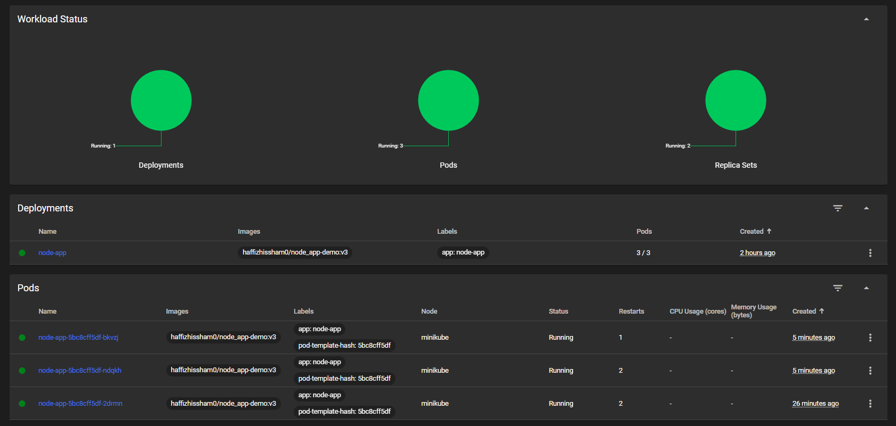

## V2 - Use YAML for cluster's deployment & service

18. Create 2 YAML files. **Deployment** and **Service**.
    * 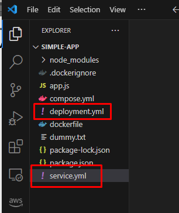

19. Copy and paste codes below.
    * ```yaml
      ### Deployment Code ###

      apiVersion: apps/v1
      # Specify type of file. eg, deployment or service
      kind: Deployment

      metadata:
         # Unique key/name of the Deployment instance
         name: node-yaml-deployment

      spec:
      # Number of replica should be deployed. eg, 2 Pods should exist at all times.
         replicas: 2
         selector:
            matchLabels:
               app: nodeapp
         template:
            metadata:
               labels:
               # Apply this label to pods and default
               # the Deployment label selector to this value
               app: nodeapp # use same app name for deployment and service #
            spec:
               containers:
               - name: node-app # name for the container #
               # Use this image for the deployment
               image: haffizhissham0/node_app-demo:v4
      ```
    * ```yaml
      ### Service Code ###

      apiVersion: v1
      # Specify type of file. eg, deployment or service
      kind: Service

      metadata:
         # Unique key of the Service instance
         name: service-example
      spec:
         ports:
            # Accept traffic sent to port 80
            - name: http
               port: 80
               targetPort: 8081
         selector:
            # Loadbalance traffic across Pods matching
            # this label selector
            # use same name like app label on deployment.yml #
            app: nodeapp

         # Create an HA proxy in the cloud provider
         # with an External IP address - *Only supported
         # by some cloud providers*
         type: LoadBalancer
      ```
20. Start minikube service like **steps (3)** and **steps (4)**

21. Expose port for the deployment and tunnel the deployment to localhost like **steps (5)** and **steps (6)**

22. Make sure terminal are on the same directory of the YAML files.

23. Run the YAML file
    * ```kubectl apply -f deployment.yml``` & ```kubectl apply -f service.yml```

24. Monitoring changes happening on K8s/Minikube dashboard

25. Play around by changing the image in in **deployment.yml**
    * eg, change image:tag to prior version   b.	
    * run the YAML again
    * or, alternatively can try to edit the deployment directly
      * ```kubectl edit pod pod_name```
      * ```kubectl edit deployment deployment_name```
    * monitor dashboard to see changes happening
