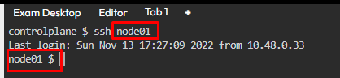
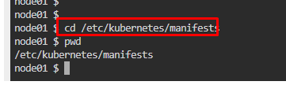
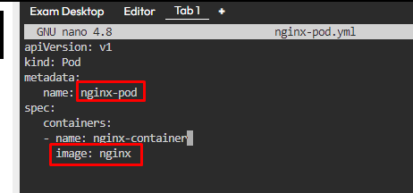
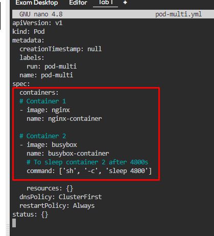

# Kubernetes Test Questions 2; 8 May 2024

##### Questions
```
1.
Create a static pod named 'nginx-pod' on node01 with the NGINX image. 
Ensure that the pod automatically restarts in case of any failure. 

Describe the steps you would take to achieve this, including the YAML configuration and the directory where you would place the configuration file.

____________


2.Design a Kubernetes pod named 'pod-multi' consisting of two containers.

Container 1 should be named 'nginx-container' and use the NGINX image, while Container 2 should be named 'busybox-container' and use the BusyBox image with a command to sleep for 4800 seconds. 

Provide the YAML configuration for this pod setup, ensuring that both containers are correctly defined. Additionally, discuss any considerations or potential issues when deploying pods with multiple containers.
```


## Question 1:
1. Connect to **node01**. Run this command, `ssh node01`
   * 

2. Find the path of kubelet config, `ps aux | grep kubelet`
   * 

3. Find the path of the **pod manifest folder** from kubelet config file, `cat /var/lib/kubelet/config.yaml | grep static`
   * 

4. Change the directory, go to the pod manifest folder. `cd /etc/kubernetes/manifests`
   * 

5. Create a config file for the manifest folder, `nano nginx-pod.yml`
   
6. Write a YAML script following question’s requirements:
   * ```yaml
      apiVersion: v1
      kind: Pod
      metadata:
        name: nginx-pod
      spec:
        containers:
        - name: nginx-container
        image: nginx
      ```
   * 

7. Exit ssh connection, check pod status. `kubectl get pods`
   * 

8. Need to **fix** container **auto restart policy**. 
   * Add `restartPolicy: Always` in the YAML code. Connect to **node01** again to edit the **manifest file**
   * 


<br>
<br>

## Question 2:
1. Run a **dry-run** command to generate a basic YAML file, `kubectl run pod-multi --image=nginx -o yaml --dry-run=client > pod-multi.yml`
   * 

2. Edit **pod-multi.yml** file following question’s requirements. `nano pod-multi.yml`
   * 

3. Apply the YAML config to create containers. `kubectl apply -f pod-multi.yml`
   * Check pods created
   * 
   * 