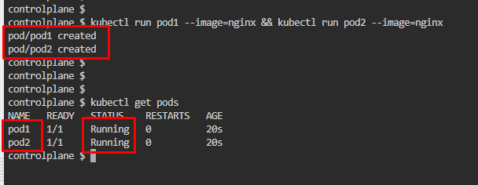
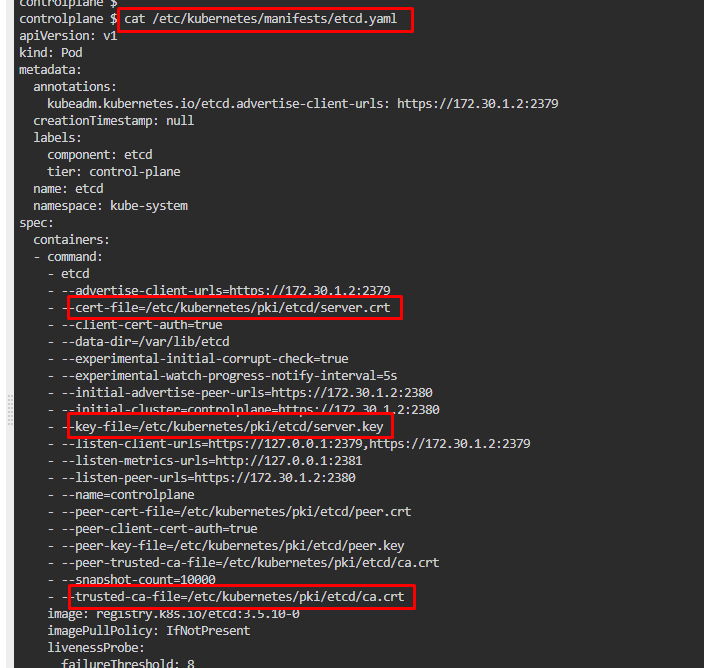
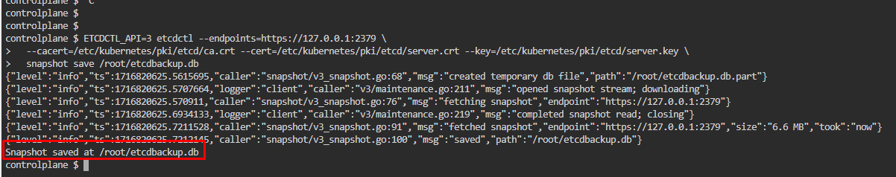
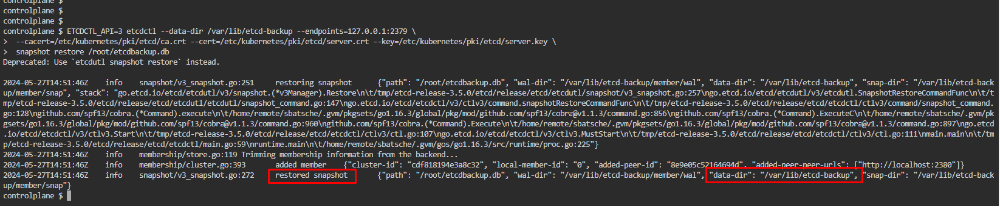
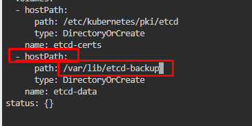
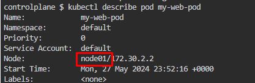
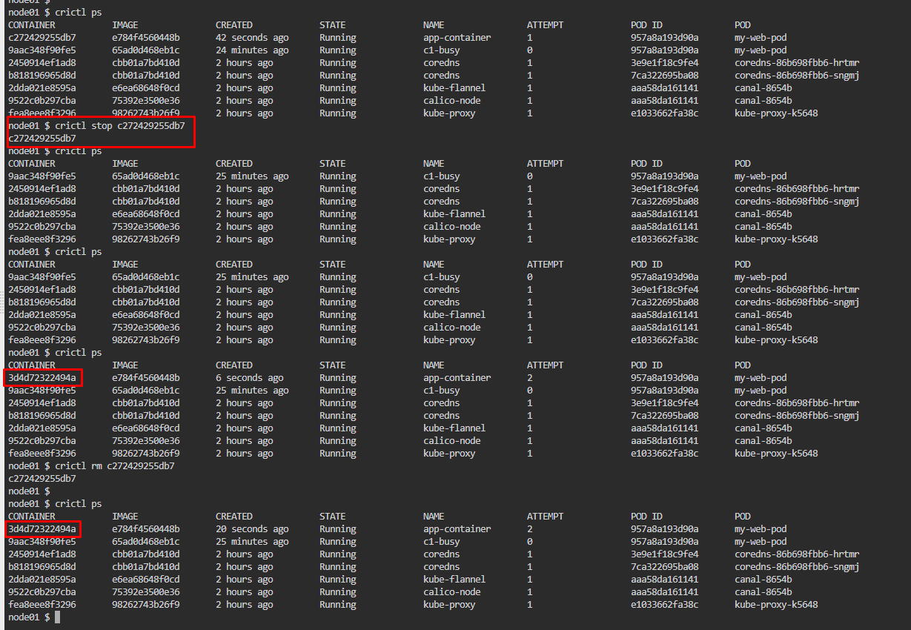

# Kubernetes Test Questions 10; 27 May 2024

##### Questions
```
1.
There is a multiple pods running in node. Take a backup of the pod ETCD database and then
delete the pod and restore the pod again.

2.
You have a pod named my-web-pod running in your Kubernetes cluster. Capture the logs and the container ID of the app-container container and save them to the specified locations. Then, restart the app-container container and log the cluster events to the /root/cluster-events.log file.
    • Save the logs to /root/app-logs.txt
    •Save the container ID to /root/app-id.txt
```
<br>

## References:
1. [Snapshot using etcdctl options | Operating etcd clusters for Kubernetes](https://kubernetes.io/docs/tasks/administer-cluster/configure-upgrade-etcd/#snapshot-using-etcdctl-options)
2. [Built-in snapshot | Operating etcd clusters for Kubernetes](https://kubernetes.io/docs/tasks/administer-cluster/configure-upgrade-etcd/#built-in-snapshot)
3. [Restoring an etcd cluster | Operating etcd clusters for Kubernetes]([https:](https://kubernetes.io/docs/tasks/administer-cluster/configure-upgrade-etcd/#restoring-an-etcd-cluster))
4. [kubectl Quick Reference | Kubernetes](https://kubernetes.io/docs/reference/kubectl/quick-reference/)
5. [Debugging Kubernetes nodes with crictl | Kubernetes](https://kubernetes.io/docs/tasks/debug/debug-cluster/crictl/)

<br>

## Question 1:
1. **Run 2 pods**, `kubectl run pod1 --image=nginx && kubectl run pod2 --image=nginx`
   
2. Check pods created, `kubectl get pods`
   * 

3. Refer to ***Snapshot using etcdctl options guide***, get paths for **trusted-ca-file**, **cert-file**, **key-file**
   * Find the path in manifest’s etcd file, `cat /etc/kubernetes/manifests/etcd.yaml`
   * 

4. Run this modified command to create an etcd snapshot
   * ```
        ETCDCTL_API=3 etcdctl --endpoints=https://127.0.0.1:2379 \
        --cacert=/etc/kubernetes/pki/etcd/ca.crt --cert=/etc/kubernetes/pki/etcd/server.crt --key=/etc/kubernetes/pki/etcd/server.key \
        snapshot save /root/etcdbackup.db
      ```
   * Run the command to create the snapshot
   * 

5. Verify the snapshot create, `ETCDCTL_API=3 etcdctl --write-out=table snapshot status etcdbackup.db`
   * 

6. Check running pods, delete it to restore snapshot created earlier
   * 

7. Modify previous command to restore snapshot
   * ```
        ETCDCTL_API=3 etcdctl --data-dir /var/lib/etcd-backup --endpoints=https://127.0.0.1:2379 \
        --cacert=/etc/kubernetes/pki/etcd/ca.crt --cert=/etc/kubernetes/pki/etcd/server.crt --key=/etc/kubernetes/pki/etcd/server.key \
        snapshot restore /root/etcdbackup.db
      ```
   * `--data-dir /var/lib/etcd-backup`, option to specify to which folder the cluster should be restored
   * `restore`, change ***save*** to ***restore***
   * 

8. Edit etcd script in manifest to restore the snapshot, `nano /etc/kubernetes/manifests/etcd.yaml`
   * Change the hostPath to use **/var/lib/etcd-backup** folder created during the snapshot restoration
* 

9. Save the script and get pod status (need to wait a while for it to take effect), `kubectl get pod`
* 

<br>
<br>

## Question 2:
1. Create a new YAML file and apply this script to create 1 pod with 2 containers, `kubectl apply -f my-web-pod.yaml`
   * ```yaml
        apiVersion: v1
        kind: Pod
        metadata:
            name: my-web-pod
        spec:
            containers:
            - name: c1-busy
                image: busybox
                command: ['sh', '-c', 'while true; do echo hello; sleep 10; done']
            - name: app-container
                image: nginx
      ```
   * 

2. Get the **logs** of **app-container** and save it to **/root/app-logs.txt**
   * 

3. Check location of the node the pod my-web-pod is running on, `kubectl describe pod my-web-pod`
   * 

4. **SSH into node01**, run a command to check running container in the node, `crictl ps`
   * Identify Container ID for app-container, save it under **/root/app-id.txt** at controlplane node
   * `echo "f37fc17b02665" > /root/app-id.txt`
   * 
   * 

5. **SSH indo node01** again to **restart** the **app-container**
   * Stop or remove the container; `crictl stop c272429255db7` / `crictl rm c272429255db7`
   * 

6. **Exit node01**, got to controlplane to **check cluster events**
   * `kubectl get events --sort-by=.metadata.creationTimestamp `
     * or `kubectl get events --field-selector involvedObject.name=my-web-pod` if want to **filter** the event for **my-web-pod**
   * 

7. Save the logs on **/root/cluster-events.log**
   * `kubectl get events --sort-by=.metadata.creationTimestamp > /root/cluster-events.log`  
     * or `kubectl get events --field-selector involvedObject.name=my-web-pod > /root/cluster-events.log`  
   * 

