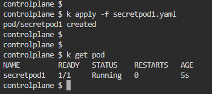
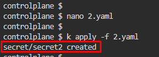
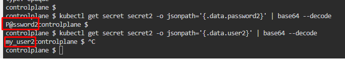

# Kubernetes Test Questions 12; 30 May 2024

##### Questions
```
1.
Create a pod named secretpod1, using image nginx.
    • Setup the secret secret1 as a volume mount on the pod at path /etc/secret1
    • Verify that the secret was created with the correct data

---

2.
Create a yaml file to create a secret named secret2, with key value pairs 
    • user2=my_user2
    • password2=P@ssword2

Verify that the secret was created with the correct data
```
<br>

## References:
1. [Secrets | Kubernetes](https://kubernetes.io/docs/concepts/configuration/secret/#docker-config-secrets)
2. [Managing Secrets using kubectl | Kubernetes](https://kubernetes.io/docs/tasks/configmap-secret/managing-secret-using-kubectl/)
3. [ConfigMaps | Kubernetes](https://kubernetes.io/docs/concepts/configuration/configmap/)

<br>

## Question 1:
1. 1.	Create a secret secret1, `kubectl create secret generic secret1 --from-literal=username=my_user1`
   * 

2. Create a YAML file for secretpod1, `nano secretpod1.yaml`
   * Apply the YAML file written, `k apply -f secretpod1.yaml`
   * ```yaml
        apiVersion: v1
        kind: Pod
        metadata:
          name: secretpod1
        spec:
          containers:
            - name: pod
            image: nginx
            command: ['sh', '-c', 'cat /etc/secret1/username && sleep 3600']
            volumeMounts:
                - name: secret-volume
                mountPath: /etc/secret1
                readOnly: true
        volumes:
            - name: secret-volume
            secret:
                secretName: secret1
      ```
   * 

3. Verify that the secret created. View username **via exec command**, `kubectl exec -it secretpod1 -- cat /etc/secret1/username`
   * 

<br>

## Question 2:
1. Create a **YAML file** to **create a secret** named **secret2**, `nano 2.yaml`
   * ```yaml
        apiVersion: v1
        kind: Secret
        metadata:
          name: secret2
        type: Opaque
        data:
          user2: bXlfdXNlcjI=
          password2: UEBzc3dvcmQy
      ```
   * **`bXlfdXNlcjI=`** is my_user2 in base64
   * **`bXlfdXNlcjI=`** is P@ssword2 in base64

2. Verify that the secret. View the **username2** and **password2** created
   * 
   * 
   * `kubectl get secret secret2 -o yaml` 
     * 
   * Or use **JSONPath** to view the user2 and password2 created
     * `kubectl get secret secret2 -o jsonpath='{.data.password2}' | base64 –decode`
     * `controlplane $ kubectl get secret secret2 -o jsonpath='{.data.user2}' | base64 --decode`
     * 

