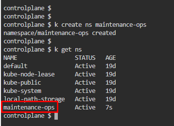
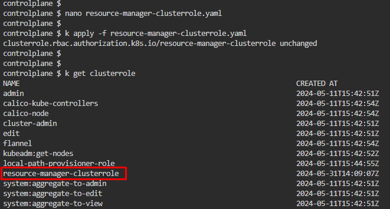
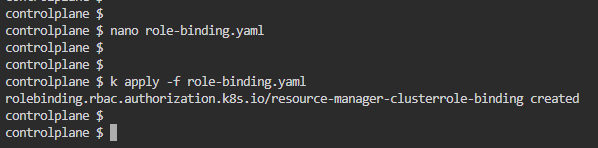
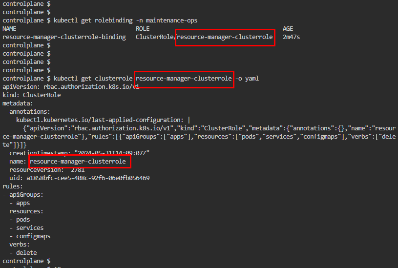

# Kubernetes Test Questions 13; 31 May 2024

##### Questions
```
Create a new ClusterRole named resource-manager-clusterrole that only allows the deletion of the following resource types:
    • Pods
    • Services
    • ConfigMaps

Create a new ServiceAccount named maintenance-token in a namespace named maintenance-ops. 

Limited to the namespace maintenance-ops, bind the new ClusterRole to the new ServiceAccount maintenance-token.
```
<br>

## References:
1. [ClusterRole example | Using RBAC Authorization](https://kubernetes.io/docs/reference/access-authn-authz/rbac/#clusterrole-example)
2. [Opt out of API credential automounting](https://kubernetes.io/docs/tasks/configure-pod-container/configure-service-account/#opt-out-of-api-credential-automounting)
3. [RoleBinding and ClusterRoleBinding example | Using RBAC Authorization](https://kubernetes.io/docs/reference/access-authn-authz/rbac/#rolebinding-example)

<br>

## Steps:
1. Create a **namespace** named **maintenance-ops**, `kubectl create secret generic secret1 --from-literal=username=my_user1`
   * 

2. Create a YAML file for **ClusterRole** named **resource-manager-clusterrole**, `nano resource-manager-clusterrole.yaml`
   * ```yaml
        apiVersion: rbac.authorization.k8s.io/v1
        kind: ClusterRole
        metadata:
          # "namespace" omitted since ClusterRoles are not namespaced
          name: resource-manager-clusterrole
        rules:
          - apiGroups: ["apps"]
          # what kind of resources this role could access
          resources: ["pods", "services", "configmaps"]
          # what kind of action  this role could do
          verbs: ["delete"]
      ```
   * 

3. Create a YAML file for **ServiceAccount** named **maintenance-token**, `nano maintenance-token.yaml`
   * ```yaml
        apiVersion: v1
        kind: ServiceAccount
        metadata:
          name: maintenance-token
          namespace: maintenance-ops
      ```
   * 

4. Create a YAML file to **bind** role **resource-manager-clusterrole** to **ServiceAccount maintenance**
   * `nano role-binding.yaml`
   * ```yaml
        apiVersion: rbac.authorization.k8s.io/v1
        # This role binding allows "jane" to read pods in the "default" namespace.
        # You need to already have a Role named "pod-reader" in that namespace.
        kind: RoleBinding
        metadata:
          name: resource-manager-clusterrole-binding
          namespace: maintenance-ops
        subjects:
          # You can specify more than one "subject"
          - kind: ServiceAccount
          name: maintenance-token
        roleRef:
          # "roleRef" specifies the binding to a Role / ClusterRole
          kind: ClusterRole
          name: resource-manager-clusterrole
          apiGroup: rbac.authorization.k8s.io
      ```
   * 

5. Check role binding applied
   * `kubectl get rolebinding -n maintenance-ops`
   * `kubectl get clusterrole resource-manager-clusterrole -o yaml`
   * 
