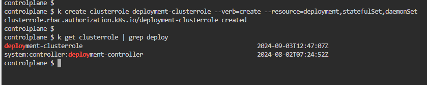
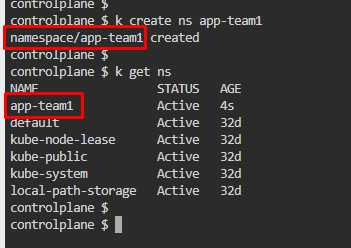
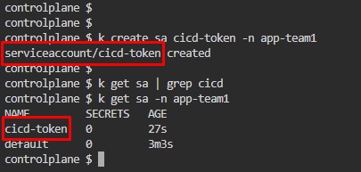
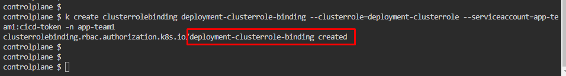
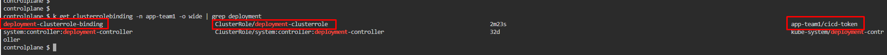

# IT Exams - Certified Kubernetes Administrator
Last Updated: August 30th, 2024 <br>
[Source](https://www.itexams.com/info/CKA)

### Question #1
```
Context - You have been asked to create a new ClusterRole for a deployment pipeline and bind it to a specific ServiceAccount scoped to a specific namespace.

Task - Create a new ClusterRole named deployment-clusterrole, which only allows to create the following resource types:
✑ Deployment
✑ Stateful Set
✑ DaemonSet

Create a new ServiceAccount named cicd-token in the existing namespace app-team1.
Bind the new ClusterRole deployment-clusterrole to the new ServiceAccount cicd-token, limited to the namespace app-team1.
```
#### References:
* https://kubernetes.io/docs/reference/kubectl/quick-reference/
* https://kubernetes.io/docs/reference/access-authn-authz/rbac/

1. Create a `ClusterRole` named `deployment-clusterrole` with only privillege to create *Deployment, Stateful Set, & DaemonSet*
   * `k create clusterrole deployment-clusterrole --verb=create --resource=deployment,statefulSet,daemonSet`
   * 

2. Create `app-team1` namespace to fit the scenario
   * 

3. Create a `ServiceAccount` named `cicd-token` in existing namespace `app-team1`
  * `k create sa cicd-token -n app-team1`
  * 

4. Bind `ClusterRole` with `cicd-token` in `app-team1` namespace
   * `k create clusterrolebinding deployment-clusterrole-binding --clusterrole=deployment-clusterrole --serviceaccount=app-team1:cicd-token -n app-team1`
   * 

5. [NOT COMPULSARY] can verify the binding was succesfull
   * `k get clusterrolebinding -n app-team1 -o wide | grep deployment`
   * 
---

### Question #2asas08723
```
Create a network policy named “double” in default namespace. There should be two types ingress and egress.
The ingress should block traffic from IP range of your choice except some other IP range. Should also have namespace and pod selector.
Ports for ingress policy should be 6379.
For egress, it should allow traffic to an IP range of your choice on 5978 port.
```
#### References:
* https://kubernetes.io/docs/reference/kubectl/quick-reference/
* https://kubernetes.io/docs/concepts/services-networking/network-policies/#networkpolicy-resource

1. Create a YAML file for a new network policy, `nano netpol-double.yaml`
2. Paste a script from K8s documentation and modify it according as per question.
```yaml
apiVersion: networking.k8s.io/v1
kind: NetworkPolicy
metadata:
  name: double
  namespace: default
spec:
  policyTypes:
  - Ingress
  - Egress
  ingress:
  - from:
    - ipBlock:
        cidr: 172.17.0.0/16
        except:
        - 172.17.1.0/24
    - namespaceSelector:
        matchLabels:
          project: myproject
    - podSelector:
        matchLabels:
          role: frontend
    ports:
    - protocol: TCP
      port: 6379
  egress:
  - to:
    - ipBlock:
        cidr: 169.18.0.0/16
    ports:
    - protocol: TCP
      port: 5978
```
3. 


---


### Question #3
```
You have access to multiple clusters from your main terminal through kubectl contexts. Write all those context names into /opt/course/1/contexts.
Next write a command to display the current context into /opt/course/1/context_default_kubectl.sh, the command should use kubectl.
Finally write a second command doing the same thing into /opt/course/1/context_default_no_kubectl.sh, but without the use of kubectl.
```