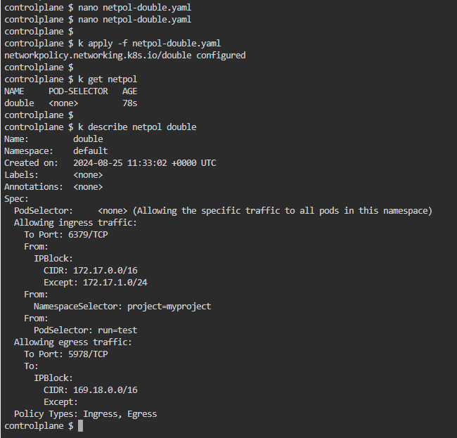

# Mock Exam 1
##### Sam Class

### Question #1
```
Create a replicaset (name:mychip, image:busybox, Replicaset: 4).
There is already a pod running in cluster.
Make sure that the total  count of pods running in the cluster not more than 4.
Note: Create scenario
```
#### References:
* https://kubernetes.io/docs/reference/kubectl/quick-reference/
* https://kubernetes.io/docs/concepts/workloads/controllers/replicaset/#example


### Question #2
```
Create a network policy named “double” in default namespace. There should be two types ingress and egress.
The ingress should block traffic from IP range of your choice except some other IP range. Should also have namespace and pod selector.
Ports for ingress policy should be 6379.
For egress, it should allow traffic to an IP range of your choice on 5978 port.
```
#### References:
* https://kubernetes.io/docs/reference/kubectl/quick-reference/
* https://kubernetes.io/docs/concepts/services-networking/network-policies/#networkpolicy-resource

1. Create a YAML file for a new network policy, `nano netpol-double.yaml`
2. Paste a script from K8s documentation and modify it according as per question.
```yaml
apiVersion: networking.k8s.io/v1
kind: NetworkPolicy
metadata:
  name: double
  namespace: default
spec:
  policyTypes:
  - Ingress
  - Egress
  ingress:
  - from:
    - ipBlock:
        cidr: 172.17.0.0/16
        except:
        - 172.17.1.0/24
    - namespaceSelector:
        matchLabels:
          project: myproject
    - podSelector:
        matchLabels:
          role: frontend
    ports:
    - protocol: TCP
      port: 6379
  egress:
  - to:
    - ipBlock:
        cidr: 169.18.0.0/16
    ports:
    - protocol: TCP
      port: 5978
```
3. 